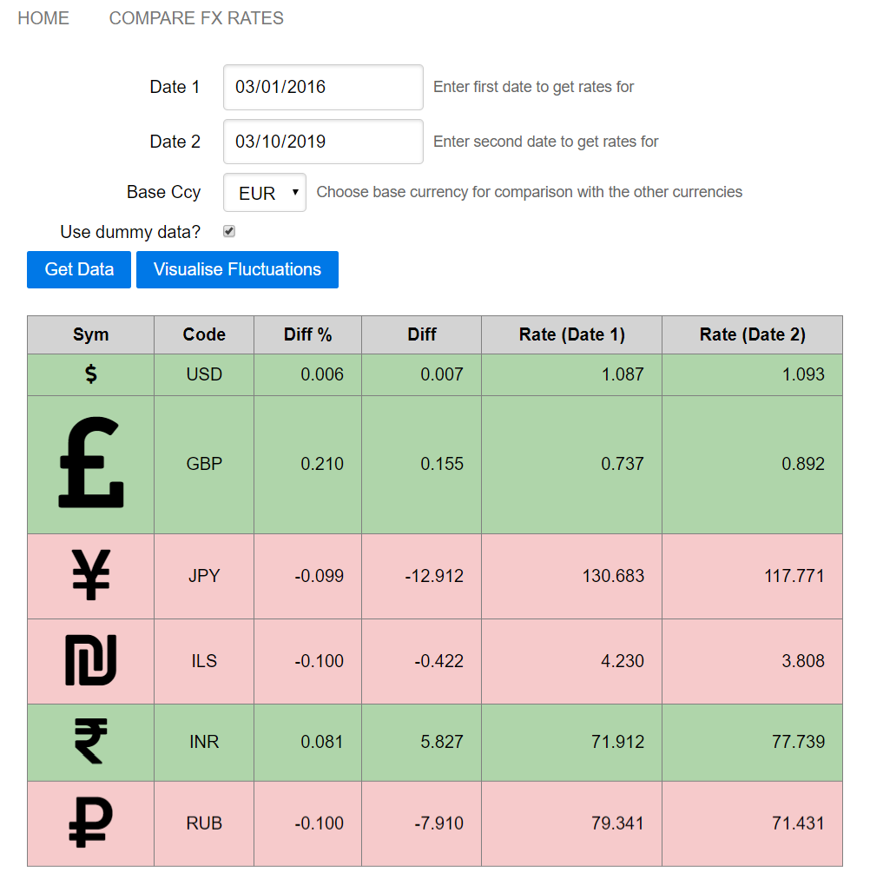

# FX Visualiser (fx-visualiser)

## Functionality

This site allows the user to visualise the change in FX rates between two different dates. It uses an API to get the rates from fixer.io. Once the data is returned, the user can choose to visualise the change in rates in two ways - colour of the rows (red for where a rate went down between the dates and green for where the rate went up) and change the font size of the currency symbol (the larger the change in the rate, the larger the symbol will be).

## Learning

This was my first project using JavaScript functions and classes. I wrote this as an example of getting data from an external API, doing calculations using JavaScript functions and class methods and updating the DOM based on the resulting data.

I modelled Rate and Rates classes to hold the state of the FX rates being returned from the external API. The API allows retrieval of rates for a given date. I call this twice to get data for the two dates selected by the user and my classes calculate the variance in rate between the two dates.

As the API only gives rates with respect to a fixed base currency (EUR), my classes also recalculate the data with respect to the base currency chosen by the user.

## Screenshot

